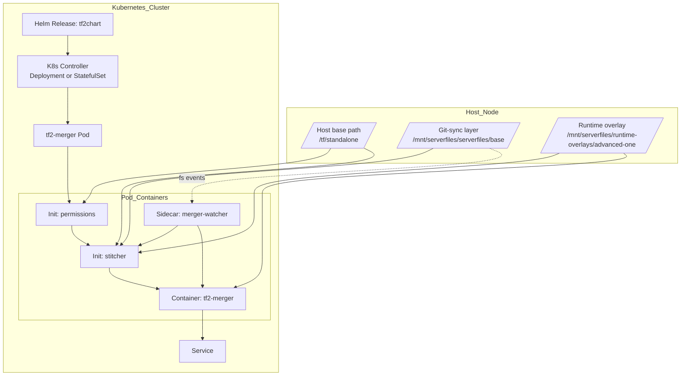
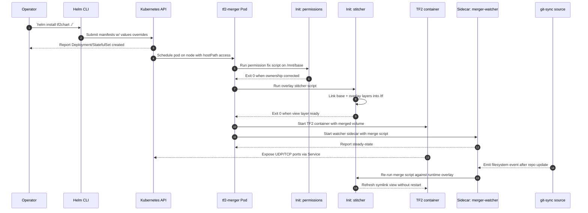
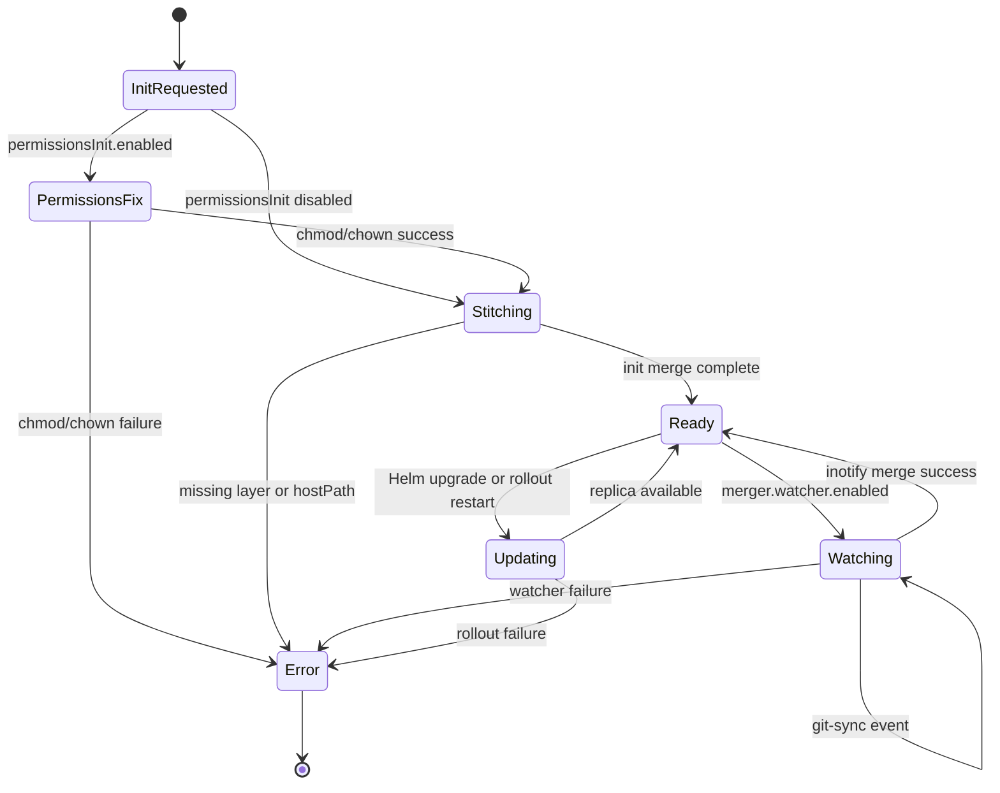

# TF2Chart

Helm chart that builds a writable Team Fortress 2 content tree inside Kubernetes by stitching host-mounted layers, overlays, and passthrough directories.

## Overview

TF2Chart packages a battle-tested set of Kubernetes manifests that turn any node with TF2 server assets into a dynamically merged content source. It abstracts the tedious hostPath wiring, permissions management, and overlay stitching that TF2-based workloads typically require so operators can focus on gameplay tuning rather than storage mechanics.

The chart deploys a `tf2-merger` pod that first normalizes file ownership, then creates a layered filesystem view combining the immutable base install, additive overlays, and writable passthrough directories. Once assembled, the main TF2 container can mount `/tf` as if it were a single coherent tree, even though the data originates from multiple heterogeneous storage targets.

### Key Responsibilities

- **Orchestrate**: Render Deployment or StatefulSet manifests with the correct labels, strategies, and replica counts.
- **Merge**: Run the `stitcher` init container that links host base content, overlay volumes, and writable paths into a single view layer.
- **Harden**: Optionally fix ownership and permissions before the merge to avoid runtime `EACCES` errors when pods run as non-root users.
- **Expose**: Provision a Kubernetes Service (cluster IP or headless) tailored to the app ports, keeping UDP-heavy TF2 traffic addressable.

## Architecture



## How It Works

### Dynamic Merge Flow



### Controller State Machine



## Features

- **Flexible Workload Kind**: Toggle between Deployment and StatefulSet via `workload.kind` to match stateless or sticky TF2 workloads.
- **Compiled Utilities**: Purpose-built Go binaries handle permissions, stitching, and the runtime watcher for reproducible behavior across images and distros, while the entrypoint init container copies from the primary TF2 image so the upstream script stays authoritative.
- **Deterministic Overlay Merge**: Ordered `overlays` list ensures predictable layer precedence when linking assets into `/tf`.
- **Writable Passthroughs**: `writablePaths` keep logs and configs persistent by pointing subpaths back to the host base directory.
- **Optional Merger Bypass**: Disable `merger.enabled` to mount the host tree directly for debugging or trusted environments.
- **Pre/Post Init Hooks**: `initContainers.pre` / `post` arrays let you inject custom scripts around the built-in steps.
- **Permissions Guardrail**: `permissionsInit` container normalizes UID/GID/mode before the main workload starts.
- **Service Customization**: Supports UDP/TCP combos, headless Services, and external traffic policies tailored to game networking.
- **Security Controls**: Pass custom `securityContext`, node selectors, tolerations, and affinity for hard multi-tenancy boundaries.
- **Resource Tuning**: Provide per-container `resources` blocks for both merger and application containers to avoid noisy neighbors.
- **Extensible Volume Model**: Combine hostPath, PVC, ConfigMap, or Secret overlays plus arbitrary `extraVolumes` for advanced layouts.
- **Continuous Stitch Watcher**: An optional sidecar streams `inotify` events from git-sync overlays and re-runs the stitcher whenever new commits land, ensuring symlinks and runtime overlays stay fresh without restarting the pod.
- **Self-Healing Links**: Each merge pass prunes dangling symlinks so deleted upstream files do not linger as broken entries inside `/tf`.
- **Git-Sync Aware Watching**: Overlays can declare parent directories for event watching, so atomic git-sync renames are detected immediately even when the repo root is replaced wholesale.
- **Adaptive Watch Paths**: The watcher waits for git-sync to recreate directories, can optionally monitor `/mnt/base`, and avoids kernel watch limits by default.

## Prerequisites

- Kubernetes cluster v1.25+ with nodes that expose the TF2 host directories via hostPath.
- Helm 3.12+ installed on the operator workstation or CI runner.
- TF2 base installation replicated at `/tf/standalone` (or alternate `paths.hostSource`).
- Steam Game Server Login Token (GSLT) for the TF2 server container.
- Network policy or firewall rules that allow UDP 28015 (or chosen game port) between players and the cluster nodes.

## Installation

1. Clone or vendor the chart alongside your TF2 assets.
2. Create a values file that points `paths.hostSource`, `overlays`, writable paths, and TF2 environment variables to your infrastructure.
3. Deploy with Helm:
   ```bash
   helm upgrade --install tf2chart ./TF2Chart \
     --namespace gameservers --create-namespace \
     -f my-values.yaml
   ```
4. Verify the pod starts, overlays link correctly, and the Service exposes the expected UDP ports.

## Configuration

### Environment Variables

| Variable            | Description                                                                   | Default              | Required |
| ------------------- | ----------------------------------------------------------------------------- | -------------------- | -------- |
| `SRCDS_TOKEN`       | Steam Game Server Login Token passed through `app.env` for TF2 authentication | ``                   | Yes      |
| `SRCDS_PW`          | Optional password clients must enter before joining the server                | ``                   | No       |
| `SRCDS_MAXPLAYERS`  | Maximum player slots advertised to the TF2 master servers                     | `24`                 | No       |
| `SRCDS_REGION`      | Region code reported to matchmaking services                                  | `255`                | No       |
| `TF2_CUSTOM_CONFIG` | Path to a custom configuration file mounted inside the view layer             | `/tf/cfg/server.cfg` | No       |

### Writable Paths & Runtime Overlays

`writablePaths` now accepts either the legacy string form (`tf/logs`) or an object that maps the writable directory to a specific overlay volume. This makes it easy to layer a git-managed base on top of an additive runtime path that survives `git-sync` resets.

```yaml
overlays:
  - name: serverfiles-base
    type: hostPath
    path: /mnt/serverfiles/serverfiles/base
    hostPathType: Directory
    readOnly: true
    watchParentDepth: 1 # also watch /mnt/serverfiles/serverfiles for git-sync swaps
    extraWatchPaths:
      - /mnt/serverfiles # optional explicit parent directories
  - name: serverfiles-runtime
    type: hostPath
    path: /mnt/serverfiles/runtime-overlays/advanced-one
    hostPathType: DirectoryOrCreate
    readOnly: false

# Mount only a nested directory from the hostPath by setting `subPath`.
# This is handy when tools like git-sync delete and recreate the final
# directory; by mounting the parent and using subPath, Kubernetes keeps
# the bind mount stable while the child path is refreshed.
overlays:
  - name: serverfiles-base
    type: hostPath
    path: /mnt/serverfiles # parent directory on the host
    subPath: serverfiles/base # child directory to mount in the pod
    readOnly: true

# If you still need to mount the entire parent (to survive git-sync
# swaps) but only stitch a subdirectory, keep `path` pointing at the
# stable parent and use `sourcePath` to tell the merger which child to
# link into /tf. This avoids bind mounts going stale when git-sync
# replaces the checkout while ensuring only the desired tree is merged.
overlays:
  - name: serverfiles-base
    type: hostPath
    path: /mnt/serverfiles
    sourcePath: serverfiles/base
    readOnly: true

writablePaths:
  - path: tf/logs
    overlay: serverfiles-runtime
  - path: tf/uploads
    overlay: serverfiles-runtime
```

When a writable directory needs to start from a tracked template instead of raw symlinks, attach a `template` stanza. The merger copies those files into the writable mount (no symlinks) before the pod starts, so runtime edits stay isolated from the read-only source:

```yaml
writablePaths:
  - path: tf/tf/cfg
    overlay: serverfiles-runtime
    template:
      overlay: serverfiles-base
      sourcePath: tf/tf/cfg
      clean: true
```

If `sourceMount` is omitted the chart automatically points at `/mnt/base` or the referenced overlay. `sourcePath` defaults to the writable `path`, and `clean` controls whether the destination is wiped between merges.

When an `overlay` is supplied, TF2Chart automatically mounts `layer-<overlay>` and points the writable subPath to that volume, keeping user uploads away from the git checkout. You can also provide `subPath` or `sourceMount` for advanced PVC layouts.

### Copy-on-start Templates

Sometimes you want a directory to start from a pristine template on every pod restart, but still become writable afterwards. Declare that intent via `copyTemplates`: TF2Chart copies the source tree into the merged view during each stitch run (init container and watcher) instead of symlinking it, so runtime edits never touch the original overlay.

```yaml
copyTemplates:
  - targetPath: tf/tf/addons/sourcemod/configs/sourcebans
    overlay: serverfiles-base
    sourcePath: serverfiles/base/tf/addons/sourcemod/configs/sourcebans
    cleanTarget: true # optional, defaults to true
    targetMode: view # set to "writable" to copy into the merged tf/tf tree before writable mounts are overlaid
```

- `targetPath` is relative to `paths.containerTarget` (for example, `/tf/tf/...`).
- `overlay` picks `/mnt/overlays/<name>` as the copy source. Omit it to read from `/mnt/base`, or override with `sourceMount` to point at any mounted volume.
- `sourcePath` is the subdirectory under that mount that should be cloned.
- `cleanTarget` removes the destination before copying; set it to `false` to merge into the existing directory.

This pattern is perfect for SourceBans configs (`sb_admins.cfg`, `sb_admin_groups.cfg`): keep a tracked template in a read-only overlay, mark the folder as a writablePath, and add a `copyTemplates` rule so each rollout rewrites `/tf/tf/addons/sourcemod/configs/sourcebans` from the template before the TF2 server boots.

### Permissions Enforcement

**Important:** The `permissionsInit` container, `merger` (stitcher), and `merger.watcher` containers **must run as root** (`runAsUser: 0`) to properly change file ownership via `chown`. These containers are configured to run as root by default in `values.yaml`, even if the pod has a restrictive `podSecurityContext`.

If files are showing incorrect ownership (e.g., `65532:65532` instead of `1000:1000`), verify that:

1. The init containers are not being blocked by pod security policies
2. The `securityContext` for these containers has not been overridden to run as non-root
3. The merger and watcher containers have `runAsUser: 0` set

`permissionsInit` now supports dual-phase execution and continuous ownership fixes so the merged `/tf` tree always stays writable by SteamCMD (UID 1000) even after overlays add new files.

```yaml
permissionsInit:
  runFirst: true # chown /mnt/base before any stitching work
  runLast: true # reapply ownership to the view layer before the app starts
  postPath: /tf # defaults to the chart's container target
  applyDuringMerge: true # the stitcher + watcher re-run chown/chmod after every merge
  applyPaths:
    - /tf # optional explicit list; defaults to postPath when omitted
```

The pre-phase still targets `/mnt/base` (or your custom `path`) so existing hostPath assets become writable, while the post-phase touches the view-layer `emptyDir` so any symlinked directories under `/tf/tf` inherit the correct UID/GID. Setting `applyDuringMerge: true` ensures both the stitcher init container and the watcher sidecar repair ownership after each merge cycle, keeping runtime installs (for example, `tar` extractions inside `/tf/tf/addons`) from landing as `root:root`.

### Merger Watcher Sidecar

The new `merger.watcher` block enables a lightweight sidecar that watches `/mnt/base` (git-sync output) plus any declared overlays. It replays the stitcher logic whenever files change, so the rendered `/tf` view always reflects the latest commit without forcing pod restarts.

```yaml
merger:
  watcher:
    enabled: true
    image:
      repository: ghcr.io/udl-tf/tf2chart-watcher
      tag: latest
    events:
      [
        close_write,
        create,
        delete,
        moved_to,
        moved_from,
        delete_self,
        move_self,
      ]
    debounceSeconds: 2
    pollIntervalSeconds: 300 # fallback cadence when inotify events are missing
    watchBase: false # enable if you need to watch /mnt/base changes too
```

The watcher streams filesystem events from `fsnotify` and supplements them with a background polling loop (`pollIntervalSeconds`) so merges happen even on filesystems that do not emit inotify events (for example, NFS). Pair this with `watchParentDepth` or `extraWatchPaths` on git-sync overlays to follow atomic directory swaps—TF2Chart will watch the overlay mount **and** its parents so the watcher sees the rename the instant git-sync promotes a new checkout, patiently waiting until git-sync recreates the directory. Enable `watchBase` only when you need `/mnt/base` change detection; keeping it false reduces recursive watches and avoids hitting `fs.inotify.max_user_watches` on large installs. Each pass also removes dangling symlinks inside the view layer, preventing stale references when files are deleted upstream. You can override `command`/`args` or supply custom `watchPaths` when monitoring additional directories.

> **Note**
> The legacy shell watcher has been replaced with the compiled `watcher` binary located under `src/cmd/watcher`. It consumes the same Helm values through JSON env vars, so there is no longer a need to bake `bash`, `apk`, or `inotify-tools` into the image unless you override the command/args manually.

## Development

### Project Structure

```
TF2Chart/
├── Chart.yaml                 # Helm metadata and semantic versions
├── values.yaml                # Default settings for workloads, overlays, merger, service
└── templates/
    ├── _helpers.tpl           # Label helpers and naming utilities
    ├── _podtemplate.tpl       # Shared pod spec with init containers and volumes
    ├── deployment.yaml        # Deployment manifest renderer
    ├── service.yaml           # Service definition with dynamic port wiring
    └── statefulset.yaml       # StatefulSet manifest when workloads need stable IDs
```

### Go Helper Images

The `src/` directory contains a standalone Go module that powers the stitched init containers and watcher. Each binary lives under `cmd/<name>` with matching Dockerfiles for multi-arch builds. Run the unit tests locally with `go test ./...`, then produce images such as the merger with:

```bash
docker build -f src/cmd/merger/Dockerfile -t ghcr.io/udl-tf/tf2chart-merger:latest src
```

The Helm values default to the `ghcr.io/udl-tf/tf2chart-*` repositories but you can point them at any registry by overriding the `image.repository`/`tag` pairs.

## License

See [LICENSE](LICENSE) file for details.

## Dependencies

- [tf2-image](https://github.com/UDL-TF/TF2Image) – Base container with SteamCMD tooling used by the `tf2-merger` workload.
- [Helm](https://helm.sh/) – Package manager used to render and deploy the chart into Kubernetes.
- [Kubernetes](https://kubernetes.io/) – Target platform providing Deployments, StatefulSets, and Services consumed by the chart.
